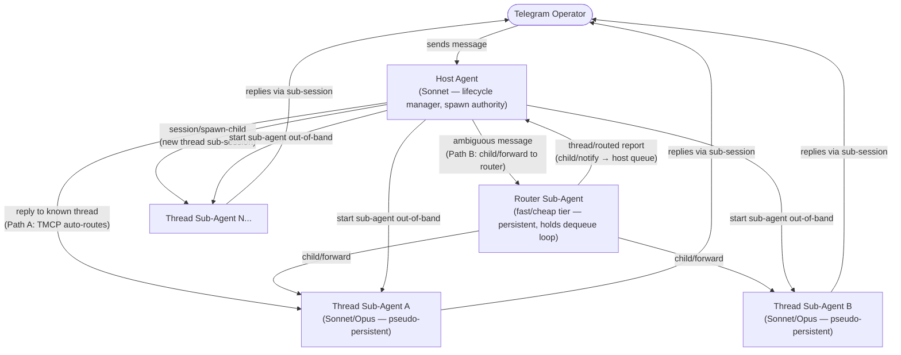
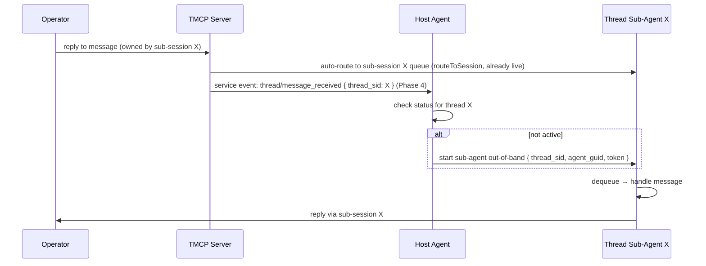
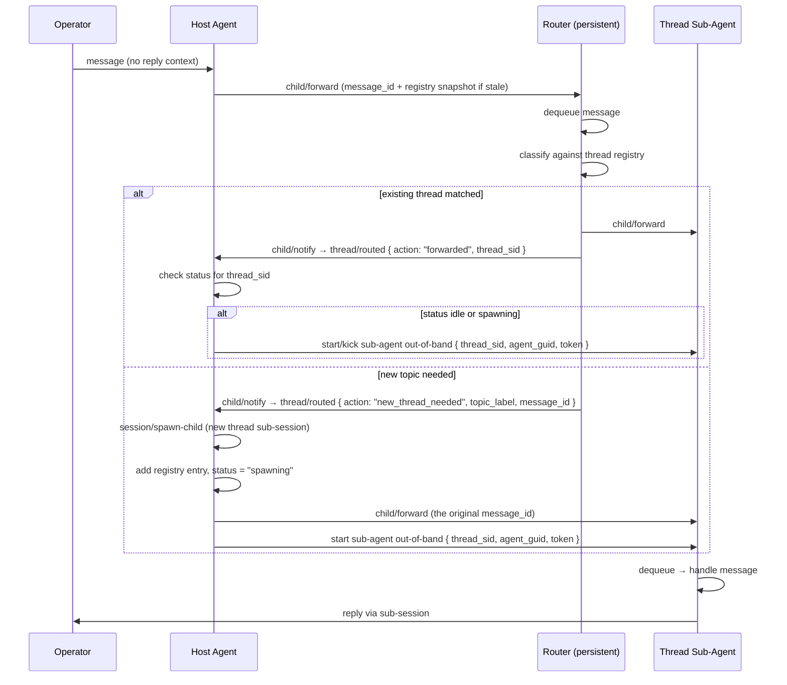
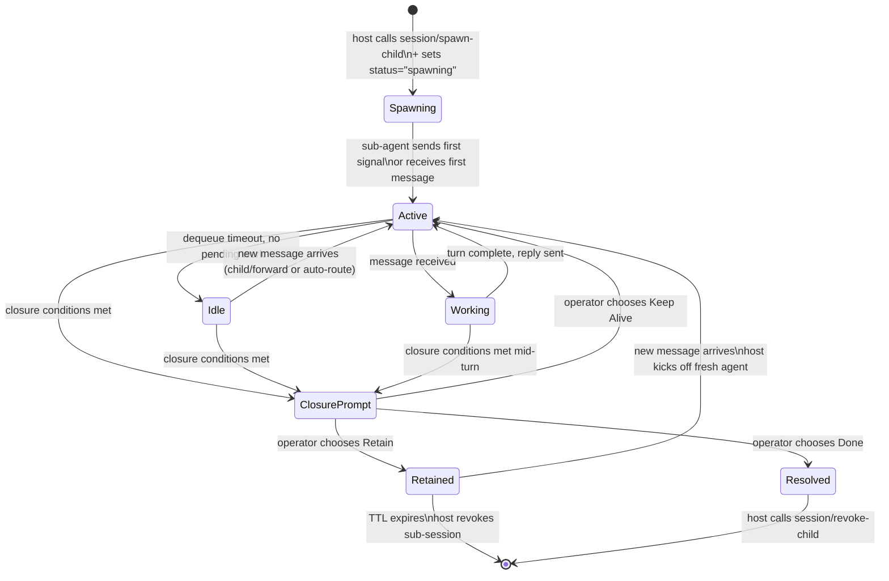

# Threaded conversations — Fix two child lifecycle notification gaps

## Architecture mandate

Complete isolation. Host never knows about message content or routing inside a child session. The ONLY legitimate host-awareness is child **lifecycle** events: closed and stale.

## Gap analysis (2026-06-21)

**What already works:**
- `child_session_resolved` fires on explicit `session/revoke-child` (host gets it) ✅
- `child_first_dequeue_confirmed` fires to parent on child's first dequeue ✅

**Gap 1 — Cascade teardown doesn't notify parent**
When a root session closes and cascades to children (`session-teardown.ts` lines 62–67), `child_session_resolved` is NOT emitted to the parent. The loop calls `closeSessionById(childSid)` + `unregisterChild(childSid)` with no `deliverServiceMessage`. Only the explicit `handleRevokeChild` path sends the resolved event.

**Gap 2 — No stale/unresponsive event to parent dequeue**
Health-check (`src/health-check.ts`) polls every 60s with 15-minute threshold, but posts to the operator Telegram channel only — blind to parent/child relationships. No `child_session_stale` event is ever delivered to the parent's dequeue.

## Acceptance criteria

AC1. When cascade teardown closes a child session (root session close path in `session-teardown.ts`), emit `child_session_resolved` to the parent's dequeue — same payload as the explicit revoke path: `{ child_sid, child_name, exit_status }`.
AC2. When health-check detects a child session is unresponsive (past the inactivity threshold), emit `child_session_stale` to the parent session's dequeue: `{ child_sid, child_name, last_active_at }`. Parent-only — not the operator channel.
AC3. Neither event carries message content, routing info, or anything about what happened inside the child. Lifecycle metadata only.
AC4. Unit tests: cascade-close emits `child_session_resolved` to parent; health-check inactivity emits `child_session_stale` to parent (not operator).
AC5. Both event types documented in the service-messages enum.

## Out of scope

- `thread/auto_routed` or any message-routing notification to host (violates isolation)
- Skills suite for host/router/thread agents (backlogged separately)
- Changes to Path A auto-routing behavior

# PRD: Threaded Conversations

## Purpose

LLMs are poor at context switching. A single Telegram session forces all inbound topics
into one agent's context, degrading focus and response quality. This feature enables the
operator to stream multiple messages on unrelated topics simultaneously — each topic is
automatically routed to an isolated sub-agent with its own context, while the host agent
remains oblivious to message content entirely.

The operator experience: messages flow naturally into coherent, focused streams. The host
is no longer a bottleneck or a context sponge.

## Scope framing

**TMCP already provides all the infrastructure this pattern requires.**
`session/spawn-child`, `session/revoke-child`, `child/forward`, `child/notify`,
`child_capability` enforcement, dequeue, and service messages are all live in the
current build.

**This spec describes the skill suite that activates the pattern** — the instruction
files, agent protocols, and routing contracts that wire the existing tools together into
a working threaded conversation system. Reply ownership tracking is already live:
`trackMessageOwner` records every outbound message's owning session, and `routeToSession`
already auto-routes inbound replies to the correct child sub-session. The one remaining
TMCP addition is a host-notification event when Path A auto-routes a reply — so the host
can perform a liveness check without being in the delivery critical path.

---

## Architecture Overview

Three layers, each with a distinct role and model tier:



> **TMCP spawn constraint (from source):** Sub-sessions cannot call `session/spawn-child`.
> Only root sessions may spawn children. The router sub-session therefore **cannot** create
> new thread sub-sessions directly. New thread creation is the host's exclusive
> responsibility: the router reports `{ action: "new_thread_needed", topic_label }` via
> `child/notify`; the host calls `session/spawn-child`, then forwards the message to the
> new child via `child/forward` and starts the sub-agent out-of-band. This division of
> responsibility is enforced by TMCP — it is not a design choice.

---

## Components

### Host Agent

**Role:** Lifecycle manager, spawn authority, and sub-agent orchestrator. Defends against
chaotic input by forwarding all ambiguous messages to the persistent router. Never reads,
evaluates, or acts on message content — content-oblivion is architectural: the host has no
responsibility that would require it.

**Responsibilities:**

- Maintains the thread registry: `{ topic_label, thread_sid, agent_guid, status }`
- On startup: spawns the persistent router sub-session once via `session/spawn-child` and
  starts the router agent out-of-band. The router runs continuously for the host session's
  lifetime.
- On each ambiguous inbound message: forwards to the router via `child/forward`, then
  continues its own dequeue loop. Does NOT spawn a new router per message.
- On `thread/routed` service event (router's `child/notify` report):
  reads the report action:
  - `"forwarded"` to an existing thread — checks `status` for the reported `thread_sid`:
    - `"absent"` or `"inactive"`: **should not occur** (router only routes to known
      threads); treat as error, log for review
    - `"spawning"`: skip — agent is already starting; message already queued
    - `"active"` or `"idle"`: skip — message already queued; router handled delivery
  - `"new_thread_needed"` — router could not create sub-session (TMCP constraint);
    host calls `session/spawn-child` for the new thread, adds registry entry with
    `status = "spawning"`, calls `child/forward` to deliver the queued message_id,
    then starts the new sub-agent out-of-band
- On `thread/resolved` from a sub-agent: call `session/revoke-child` for that thread
  sub-session, remove registry entry. No content inspection — the sub-agent has already
  handled result delivery.
- On router `thread/routed` timeout report: log; message may be lost (see Known
  Limitations M4). Router remains running — it is not revoked on timeout.
- On dequeue timeout: continue loop; optionally check for stale `"spawning"` entries
- On host shutdown: revoke the router sub-session via `session/revoke-child`.

> **Division of responsibility:** the router classifies messages and routes them to
> existing thread sub-sessions via `child/forward`. Because TMCP prevents sub-sessions
> from calling `session/spawn-child`, the host exclusively handles new thread sub-session
> creation and out-of-band sub-agent startup. The router signals the need for a new
> thread via `child/notify`; the host acts on that signal.
>
> The host does not consume content, synthesize results, or interact with the
> operator about thread outcomes. Those are the thread sub-agent's responsibilities.
> If a genuine reason to involve the host in content surfaces, it will be documented
> here.

### Router Agent (persistent, fast/cheap tier)

**Role:** Persistent sub-agent that runs a continuous dequeue loop for the lifetime of
the host session. Classifies all ambiguous inbound messages and routes them to the
correct thread sub-sessions. Currently implemented using Claude Haiku.

**Lifecycle:** host calls `session/spawn-child` once at startup → starts router agent
out-of-band → router holds its own dequeue loop continuously → on each message received,
classifies and routes → sends `thread/routed` or `thread/new_needed` report via
`child/notify` → loops back to dequeue. The router is never revoked mid-session except
on host shutdown or an unrecoverable error.

> **TMCP spawn constraint:** The router is a child sub-session and therefore **cannot**
> call `session/spawn-child`. New thread sub-sessions are always created by the host.
> The router signals the need via a `child/notify` report with `action: "new_thread_needed"`.

**What the router can and cannot do:**
- **Can:** classify, `child/forward` to existing thread sub-sessions (siblings), `child/notify` to host
- **Cannot:** `session/spawn-child` (TMCP blocks sub-sessions from spawning children), start background agents (host's responsibility)

**Responsibilities:**

- Reads an external classify/sort instruction file at startup (not baked into prompt —
  operator can update it without redeploying). Re-reads the file periodically or on a
  host-injected refresh signal to pick up classification rule changes.
- Holds a continuous `dequeue` loop on its own sub-session token
- On timeout: loops back to dequeue; emits no report (idle cycle is normal)
- On message received (forwarded from host via `child/forward`):
  - Looks up thread registry (passed as context in the forwarded message payload or
    refreshed via host `child/forward` on registry change)
  - Matches topic to existing thread SID → `child/forward` to that sub-session → reports
    `{ action: "forwarded", message_id, thread_sid }` via `child/notify`
  - No match → reports `{ action: "new_thread_needed", message_id, topic_label }` via
    `child/notify`; host handles sub-session creation and forwarding
  - **Low-confidence or ambiguous match**: routes to the **general thread** — a
    permanent catch-all sub-session always present in the registry. The router uses
    `child/forward` to the general thread's SID. The general thread sub-agent handles
    disambiguation, clarification, or triage from there. The host never receives a
    `new_thread_needed` report for these cases — routing always completes.
  - **Multi-match**: routes to the most recent active thread. If genuinely ambiguous,
    falls through to the general thread.
  - Routing report schema:
    - `{ action: "forwarded", message_id, thread_sid, topic_label? }` — delivered via
      `child/notify` as event type `thread/routed`. `topic_label` included when the
      router infers the match (informational for host registry updates).
    - `{ action: "new_thread_needed", message_id, topic_label }` — delivered via
      `child/notify` as event type `thread/routed`. Host creates the sub-session and
      forwards the message.

**Capability requirement:** `gather` — the router only needs `dequeue`, `child/forward`
(to siblings), and `child/notify`. It does not need `session/spawn-child`. Downgrading
from `full` to `gather` is the capability reduction OQ5 resolved.

**State management:** The router accumulates routing state across dequeue iterations —
its thread registry snapshot, classification history, and any per-thread confidence
signals. This is the key difference from the old ephemeral model: the router is a
stateful participant for the host session's lifetime, not a stateless one-shot classifier.

### Thread Sub-Agent (pseudo-persistent)

**Role:** Background agent that owns a single conversation thread end-to-end.

**Pseudo-persistent defined:** The sub-agent is a long-running process (not re-spawned
per message). It holds its own dequeue loop continuously. Conversational context
accumulates in-model across dequeue iterations for the lifetime of the agent instance.
"Pseudo" because it is not immortal — it can crash, be revoked, or exhaust its context
window — but under normal operation it behaves as a persistent participant.

**Responsibilities:**

- Runs its own `dequeue` loop on its sub-session token
- On message received: incorporates it, continues or restarts its turn
- On timeout: if mid-work, continues; if idle, holds and loops
- Sends all operator-facing replies via its own sub-session (operator sees the named
  session as sender)
- **Closure flow** — when both closure conditions are met (actionable result exists
  AND source confirms nothing is left), the sub-agent sends a service message to the
  operator with three buttons before doing anything else:

  | Button | Style | Action |
  | --- | --- | --- |
  | Done | `danger` (red) | Full teardown — sub-agent sends `thread/resolved`, host revokes sub-session, registry entry removed |
  | Retain | default (no colour) | Graceful idle — sub-agent exits, sub-session stays open, registry entry kept with TTL (`status = "retained"`) |
  | Keep Alive | `primary` | Cancel — sub-agent continues its dequeue loop, no state change |

  **Closure conditions (both must be true before the confirmation prompt is sent):**
  1. An actionable result exists — ticket filed, task written, decision recorded, or
     equivalent artifact persisted to a known location.
  2. The source has confirmed there is nothing left:
     - **Human source:** operator confirms verbally after receiving the result summary.
     - **Agent source:** the sending agent signals completion programmatically. Agent
       DMs are self-identifying — no additional metadata needed.

- **Closure authority:** the operator has final say via the confirmation prompt. The
  host may forcibly revoke via `session/revoke-child` (e.g., resource limits) but
  this bypasses the prompt and is exceptional.
- **Autonomous escalation:** when content warrants it, the sub-agent may spawn
  grandchild sub-sessions (permitted by `full` capability) and start those processes
  out-of-band — without involving the host. The host's registry only tracks direct
  children. Grandchild lifecycle is the sub-agent's concern.
- **General thread:** a designated catch-all sub-session for unroutable or ambiguous
  messages. Always present in the registry. Does not self-terminate based on
  completion — it persists as long as the system is active.
- Model tier: Sonnet default; the sub-agent may escalate to a grandchild at Opus tier
  when complexity warrants, without notifying the host.

**Thread outcomes:** Every thread must terminate with an actionable result — a task,
spec, decision, or transcript. At minimum, the conversation is exportable for later use.
The result is written by the sub-agent directly; the host never reads or relays it.

---

## Message Routing Paths

### Path A — Reply to known thread (no router invoked)

> **TMCP auto-routing is already live.** `trackMessageOwner` records the owning session
> for every outbound bot message. `routeToSession` checks `reply_to` on each inbound
> event and delivers it directly to the owning child sub-session. The host notification
> (`thread/message_received`) is the only missing piece — added in Phase 4.



The router is never spawned. Classification is not needed.

### Path B — Ambiguous or new message (forwarded to persistent router)

The router sub-session is already running. The host forwards the message and continues
its own dequeue loop.



The router is never spawned or revoked per message. A single router instance processes
all ambiguous messages for the host session's lifetime.

---

## TMCP Facilitation (existing)

All tools required by this pattern are already implemented:

| Tool | Role in this pattern | Status |
| --- | --- | --- |
| `session/spawn-child` | Host creates new thread sub-sessions (and router sub-session at startup) | Live |
| `session/revoke-child` | Host tears down completed threads; host revokes router on shutdown | Live |
| `child/forward` | Host forwards ambiguous messages to router; router forwards classified messages to thread sub-sessions | Live |
| `child_capability` | Router runs `gather` (classify + forward + notify only); thread agents run `full` | Live |
| `dequeue` | Router holds continuous loop; thread agents hold their own loop | Live |
| `child/notify` | Child sends structured event to parent queue. Used for: routing reports (`thread/routed`) and completion signals (`thread/resolved`). **Confirmed live in codebase** (`src/tools/session/child-notify.ts`). | Live |
| Service messages | `thread/message_received` delivered to host queue via existing mechanism | Live |
| `trackMessageOwner` + `routeToSession` | Reply auto-routing to child sub-sessions | Live |

### `child/forward` — forwarding mechanism (OQ7 resolved)

`child/forward` must forward the original `TimelineEvent` (full Telegram message metadata
including `message_id`, attachments, voice source) rather than a stripped text string.
The implementation change: accept a `message_id` parameter, look up the full event,
and re-enqueue it to the target sub-session via `enqueueToSession` — the same mechanism
`routeToSession` already uses. The text-only `deliverServiceMessage` path is replaced.

This is a prerequisite for Phase 1 (thread sub-agents must be able to reply-to and access
attachments from forwarded messages).

### Remaining TMCP addition (Phase 4 prerequisite)

When `routeToSession` auto-routes a reply to a child sub-session, inject a service event
into the parent session's queue: `{ type: "thread/message_received", thread_sid: X }`.
This gives the host a liveness signal without being in the delivery critical path.
Reply delivery to the thread itself is already handled server-side.

---

## Thread Registry

Maintained by the host agent in its own context. Serialized and passed to the router
as part of its instruction context on each dispatch.

Schema (per thread):

```text
{
  thread_sid:      number,    // sub-session SID (TMCP child session)
  agent_guid:      string,    // UUID generated by host at spawn time; stable for the
                              // lifetime of the sub-agent instance; used as the handle
                              // to identify and kick off the correct background agent
  topic_label:     string,    // human-readable topic name (set at spawn, immutable)
  status:          "spawning" | "active" | "idle" | "retained",
                              // spawning  = sub-session created, agent start triggered
                              //   but not yet confirmed (prevents double-kick-off race)
                              // active    = sub-agent confirmed running (dequeue loop
                              //   live or mid-work)
                              // idle      = dequeue timeout; still alive, holds queue
                              // retained  = operator chose "Retain"; sub-agent exited
                              //   but sub-session stays open; eligible for revival
                              //   until retained_until expires
  retained_until:  iso8601 | null,
                              // set when status becomes "retained"; null otherwise
                              // after expiry, host revokes sub-session and removes entry
  created_at:      iso8601,
  last_message:    iso8601
}
```

`agent_guid` is assigned by the host at `session/spawn-child` time (e.g., `crypto.randomUUID()`).
It is passed to the background sub-agent as its identity so the host can target the
correct agent instance if a restart is needed. It is not a TMCP concept — it is
host-layer bookkeeping only.

The host updates `status` when it creates a new thread sub-session (set to `"spawning"`),
when it receives the sub-agent's first signal (set to `"active"`), on dequeue timeout
signals (set to `"idle"`), on operator "Retain" choice (set to `"retained"`, `retained_until`
set to now + TTL), and on `thread/resolved` (entry removed from registry). On startup
reconciliation, any `"retained"` entry whose `retained_until` has passed is treated as
expired: the host revokes the sub-session and removes the entry.

Writes to `data/thread-registry.json` **must use atomic temp-file-plus-rename
semantics** and include a `schema_version` field. The file is validated against the
schema on every read. On startup/resume, the host reconciles the persisted registry
against TMCP's live child session list: any entry whose `thread_sid` has no matching
live TMCP child session is treated as crashed (see M3) and flagged for operator review.



---

## Capability Requirements

| Agent | Capability | Rationale |
| --- | --- | --- |
| Router (fast/cheap tier) | `gather` | Needs `dequeue`, `child/forward` (to siblings), `child/notify`. Cannot and need not call `session/spawn-child` — TMCP blocks sub-sessions from spawning children; new thread creation is the host's job. |
| Thread sub-agent | `full` | Full domain access; no artificial restrictions |
| Host agent | root session | Only root sessions may call `session/spawn-child`. Host is always a root session. |

---

## Known Limitations

These are acknowledged risks accepted for this version of the spec. Each may be
addressed in a future iteration.

**M3 — Stale `status` on sub-agent crash.** If a thread sub-agent dies without
sending a `thread/resolved` signal, its registry entry stays at `status = "active"`
or `"idle"`. Messages forwarded to that sub-session queue are silently undelivered
until the host detects the stale state on startup reconciliation or by timeout. No
dead-letter or re-queue mechanism exists.

**M4 — Router crash during operation.** If the router crashes mid-classification (after
dequeuing a message but before sending its `child/notify` report), the host receives no
routing report and the message is undelivered. The host detects router absence via the
`CHILD_SESSION_RESOLVED` service event (fired by TMCP on sub-session close) or on the
next `thread/routed` timeout. Recovery: host revokes the dead router sub-session, spawns
a fresh one, and marks the missed message as potentially lost (see M9 for forward-lookup
failure). No automatic re-delivery mechanism exists.

**M4b — Router context exhaustion.** The persistent router accumulates routing history
across its dequeue loop. Over a long host session, its context window may approach
limits. When this occurs the router must gracefully signal the host (`child/notify` with
`action: "context_limit"`) so the host can revoke and re-spawn a fresh router with the
current registry snapshot. Protocol for this signal is not yet specified — it is a Phase
2 concern.

**M8 — Thread resolution race.** A sub-agent may send `thread/resolved` and then be
revoked while a reply is in-flight. If the reply arrives after revocation, it is
dropped. No drain protocol or closing state exists. Acceptable for v1 given graceful
closure is operator-initiated and operator-paced, but must be addressed before
high-frequency use.

**M9 — `message_id` lookup failure in `child/forward`.** The updated `child/forward`
looks up the full `TimelineEvent` by `message_id`. If the event is not in the store
(retention cutoff, race, or attachment cleanup), the forward silently fails or
degrades. Failure path is unspecified. The host and router have no negative-ack path.

**M10 — Service event sender not validated.** The host trusts `thread/routed` and
`thread/resolved` events by event type alone. A `full`-capability sub-agent could send
`{ type: "thread/resolved", thread_sid: Y }` where Y is not its own thread, falsely
closing another thread. The host **must** validate that the sender SID matches the
`thread_sid` in the registry before acting on any control-plane service event.

**M7 — Content-oblivion is architectural by design.** The host has no responsibility
that requires reading message content. Routing decisions are delegated to the router;
result delivery is delegated to thread sub-agents. No capability fence is needed
because no use case exists for the host to consume content. The boundary holds as long
as the host's role is not expanded.

---

## Minimum Viable Configuration (Unskilled Governor)

The full pattern requires a routing skill (OQ1). However, the host agent can operate
without one — this is the onboarding path and a supported degraded mode.

**Without a skill file:**
- No router is ever spawned. Auto-classification is disabled.
- The operator drives thread creation explicitly (e.g. "start a thread on X").
- The host creates a sub-session via `session/spawn-child`, starts the sub-agent
  out-of-band, and adds it to the registry.
- Path A (reply auto-routing) works as normal — TMCP routes replies to the correct
  sub-session regardless of how it was created.
- The closure flow (Done / Retain / Keep Alive) works as normal.

This mode is fully functional for manual workflows. Add the routing skill later to
enable automatic Path B classification without changing any other part of the system.

---

## Out of Scope

- Forum topic / `message_thread_id` binding (iceboxed, 10-1952-T3)
- Alternative configurations (single-agent, synchronous dispatch, no-router variants)
- Claude Code plugin packaging of host/router skills (tracked separately, 00-0001)
- Sub-agent tier selection logic beyond "Sonnet default, Opus if needed"
- Thread export format and delivery mechanism (downstream concern)

---

## Open Questions

**Session 2026-06-01:** OQ1, OQ5, OQ8 closed; OQ3 direction set (Curator to spec TMCP idle detection). Architecture section update per OQ5 resolution (persistent router) — **completed 2026-06-21**. TMCP source audit incorporated (spawn constraint, child/notify confirmed live).

| # | Question | Decider | Decision |
| --- | --- | --- | --- |
| OQ1 | Where does the classify/sort instruction file live? (`skills/`, `data/`, operator-editable path?) | Operator | **Closed (2026-06-01).** Classify/sort instruction file lives in the host agent's `memory/` path. Agent-specific, auditable, editable without touching skills. |
| OQ2 | How does the host detect sub-agent termination? | Spec | **Closed.** Liveness is binary: sub-agent is either (a) in an active dequeue call, or (b) host has dispatched a task and not yet received `thread/resolved`. No heartbeat or ping needed. Host sets `status = "spawning"` when it kicks off; sub-agent signals via `thread/resolved` (via `child/notify`) before closing. Stale `status` on crash is Known Limitation M3. |
| OQ3 | Should the `thread/message_received` host-notification event be always-on or opt-in? | Operator | **Partially closed (2026-06-01).** Do NOT use always-on notification for every message (defeats noise-offload purpose). Instead: TMCP to add per-sub-session idle timeout (5-minute default). After 5 min of no activity from sub-session, TMCP sends host a warning service event. Host decides whether to intervene. Curator to spec the TMCP idle-detection addition. |
| OQ4 | What is the thread sub-agent's yield/completion signal back to the host? | Spec | Defined — `thread/resolved` service message. See Thread Sub-Agent section. |
| OQ5 | Should the router capability be reduced from `full` to a new `router` tier? | Operator | **Closed (2026-06-01). Architecture updated 2026-06-21.** Router is PERSISTENT — it holds its own dequeue loop for the host session's lifetime, classifying and routing all messages, reporting to host only when needed (new thread needed, etc.). Capability reduced from `full` to `gather`: the router does NOT need `session/spawn-child` because TMCP blocks sub-sessions from spawning children (source-confirmed). New thread sub-session creation is exclusively the host's responsibility; the router signals need via `child/notify`. Ephemeral-per-message router model is superseded throughout the document. |
| OQ6 | Should the thread registry be persisted to survive host context compaction? | Operator | **Closed.** Yes — host skill writes registry to `data/thread-registry.json` after every mutation (new thread, is_active change, removal). Reads on startup/resume. TMCP already writes traffic to NDJSON; conversation state is memory-only, so the host skill owns persistence. |
| OQ7 | Should `child/forward` carry full Telegram message metadata? | Spec/TMCP | **Closed.** Yes — `child/forward` re-enqueues the original `TimelineEvent` (looked up by `message_id`) via `enqueueToSession`, the same mechanism `routeToSession` uses. Text-only `deliverServiceMessage` path is replaced. This is a Phase 1 prerequisite. |
| OQ8 | What is the maximum number of concurrent thread sub-sessions? | Operator | **Closed (2026-06-01).** Maximum 9 concurrent thread sub-sessions. Hard cap enforced. Numeric circle emoji labels ①–⑨ used as thread identifiers. Show explicit 'maxed out' warning to operator if cap is hit. |
| OQ-A | Thread revival: when a topic revisits a thread after TTL expiry (sub-session closed), does the router spawn a fresh sub-session or inject historical context? | Spec/Operator | **Partially closed.** Within the TTL window (`status = "retained"`), the sub-session is still open — router routes to the same SID, host kicks off a fresh agent, context is naturally available. After TTL expiry the sub-session is revoked. Full revival from a fully closed thread remains open. |
| OQ-B | Human confirmation UX: how does the operator signal to a thread sub-agent that the thread is done? | Operator | **Closed.** Sub-agent sends a service message with three operator buttons: **Done** (red — full teardown), **Retain** (default — sub-agent exits, sub-session stays open with TTL), **Keep Alive** (primary — cancel, sub-agent continues). Operator presses a button; no free-text required. |

---

## Implementation Phases

### Phase 1 — Router skill (fast/cheap tier)

**OQ gate:** OQ1 (classification file location) must be closed before this phase. ✓ Closed.

**TMCP prerequisites (must land first):**
1. Extend `child/forward` to re-enqueue full `TimelineEvent` by `message_id` via
   `enqueueToSession` (replacing text-only path). *(Still required.)*
2. ~~Add `child/notify` tool~~ — **Already live** (`src/tools/session/child-notify.ts`).
   No TMCP work needed for this.

Write the classify/sort instruction file (in host agent `memory/`). Define the routing
report schema (`thread/routed` event, with `action: "forwarded"` and
`action: "new_thread_needed"` variants). Define thread registry serialization format for
router context injection. Write host skill for router startup and persistent-router
management. Test with a single static thread.

**Path A in Phases 1–3 (degraded):** TMCP auto-routes replies to thread sub-sessions
correctly, but the host-notification event (`thread/message_received`) is Phase 4. The
host has no liveness signal for Path A until then. Acceptable degradation: thread
sub-agents are long-lived and hold their own dequeue loop — they process auto-routed
replies without host intervention. Dead-thread recovery on Path A is unavailable until
Phase 4.

### Phase 2 — Host loop skill

**OQ gate:** OQ8 (session cap) should be closed before this phase.
**Phase 1 must be complete** (TMCP prerequisites landed, router skill tested).

Write the host loop instructions. Define liveness check and sub-agent kick-off pattern.
Define thread registry update protocol (on new thread, on agent start/stop).
Persist registry to `data/thread-registry.json` on every mutation.
Test multi-thread routing.

### Phase 3 — Thread sub-agent skill

**Phase 2 must be complete.**

Write the thread sub-agent loop instructions. Implement `thread/resolved` via
`child/notify` per spec (signal already defined — see Thread Sub-Agent section).
Define result export pattern (task, spec, transcript).

### Phase 4 — TMCP host notification for Path A

When `routeToSession` auto-delivers an inbound reply to a child sub-session, inject a
service event into the parent session's queue:
`{ type: "thread/message_received", thread_sid: X }`.
This gives the host a liveness signal without intercepting the delivery path.
The reply is already in the thread queue by the time the host reads the notification.
Opt-in vs always-on decision deferred to OQ3.

## Verification

**Verdict:** APPROVED
**Verifier:** ae01aa53af0923bc1
**Date:** 2026-06-21
**Squash commit:** 269d8fb

All 5 acceptance criteria confirmed:
- AC1 CONFIRMED: `session-teardown.ts` — cascade loop emits `child_session_resolved` to parent dequeue before `closeSessionById`, matching explicit revoke payload `{ child_sid, child_name, exit_status }`.
- AC2 CONFIRMED: `health-check.ts` — stale branch emits `child_session_stale` to parent dequeue; operator Telegram suppressed for child sessions; root sessions unchanged.
- AC3 CONFIRMED: both payloads contain lifecycle metadata only (sid, name, exit_status/last_active_at) — no message content or routing info.
- AC4 CONFIRMED: 13 new unit tests across `session-teardown.test.ts` (6 tests) and `health-check.test.ts` (7 tests).
- AC5 CONFIRMED: `CHILD_SESSION_STALE` added to `SERVICE_MESSAGES` in `service-messages.ts`.

Test gate: PASS — 3940/3940 tests, 162 test files, build+lint clean.
