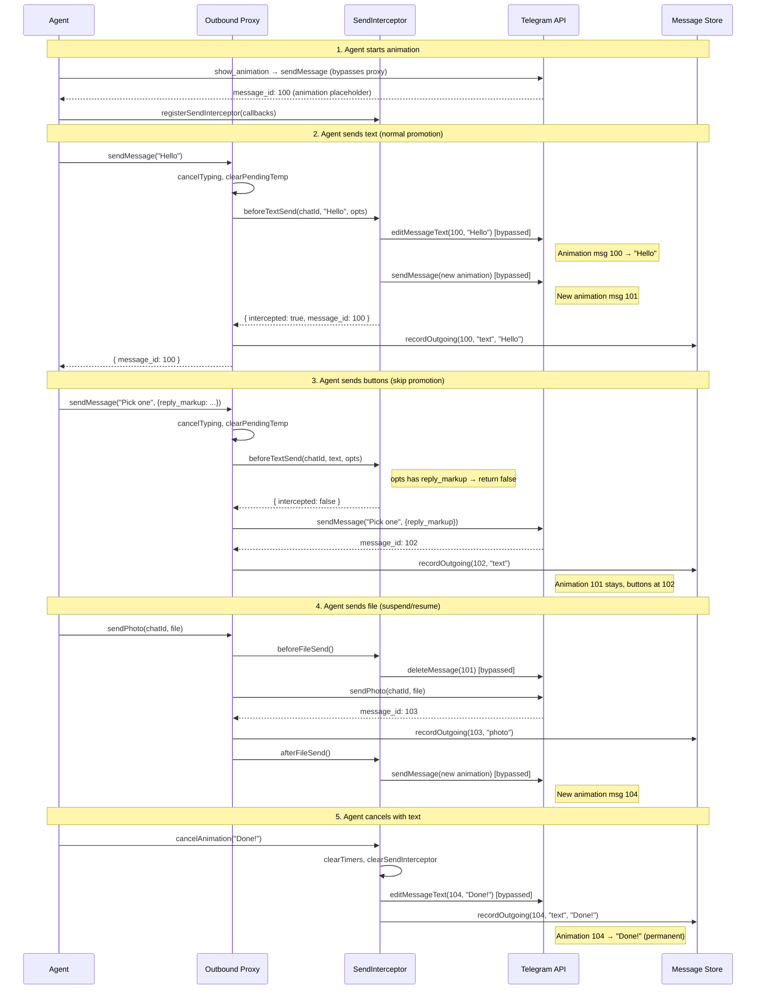

# Animation System — Message Flow

## Recording rationale

`recordOutgoing` is called whenever a message becomes permanent content:

| Scenario | Who records | When |
|---|---|---|
| Text send (promoted) | Outbound proxy | After interceptor returns `intercepted: true` |
| Text send (normal) | Outbound proxy | After `sendMessage` returns |
| File send | Outbound proxy | After API call returns |
| Cancel with text | `cancelAnimation()` | After editing animation → permanent text |
| Voice send | `sendVoiceDirect` | Via `notifyAfterFileSend()` manual hook |

The cancel-with-text recording (fix #3) was previously missing — the animation got edited to permanent text but the message store didn't know about it.
