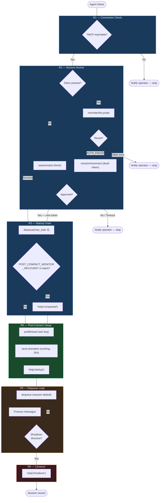

# Skill Spec: telegram-participation

## Purpose

Bootstrap any TMCP-enabled agent from zero to operational Telegram participant. One skill — gets the agent connected and the loop running. For everything else, use `help()`.

## Scope

**Covered:** Connection check, session anchor (fresh start and reconnect), startup drain, post-connect setup delegation, and dequeue loop entry.

**Not covered:** Monitor arm/verify, graceful shutdown — delegated to bridge `help()` topics. Profile load is covered explicitly in R4 Step 1 (not delegated).

## Definitions

**post_compact_monitor_recovery** — service message queued after compaction (`event_type: "post_compact_monitor_recovery"`). Signals that the prior session registration survives on the server; triggers `help('compacted')` to handle monitor recovery.

## Lifecycle Flow

## Requirements

### R1 — Connection check

| Condition | Action |
| --- | --- |
| TMCP unreachable | Notify operator; report unavailable; stop |
| TMCP reachable | Proceed to R2 |

### R2 — Session anchor

**Token absent (fresh start):** `action(type: 'session/start', name: '<AgentName>')` — operator approval dialog (blocking, up to 120s). On approval: store new token, proceed to R3. Denied or timed out: notify operator; report unavailable; stop.

**Token present:** Probe: `action(type: 'reminder/list', token: <token>)`.

| Result | Action |
| --- | --- |
| Success | Session live — proceed to R3 |
| `AUTH_FAILED` or invalid token | `action(type: 'session/reconnect', name: '<AgentName>')` — same approval dialog; store new token; proceed to R3. Denied/timeout: notify; stop. |
| Unexpected error | Notify operator; stop |

### R3 — Startup drain

Single call: `dequeue(max_wait: 0)`. Do not loop. If a `post_compact_monitor_recovery` event is in the batch, call `help('compacted')` before proceeding to R4.

### R4 — Post-connect setup

1. **Profile load (first):** `action(type: 'profile/load', key: '<agent-name>')`. Use the pod's own identifier (e.g. `bt`, `curator`, `zhuli`, `overseer`). MUST use the agent's own key — never another session's key. Idempotent; safe after compaction. Ensures voice, animation, and reminder settings are loaded before any further setup.
2. **Boot animation:** `send(type: 'animation', preset: 'working', timeout: 60, token)`. Fires the earliest visible presence signal — operator sees activity within seconds of session anchor instead of waiting through silent setup. 60s temporary; auto-clears or is superseded by the first real send. MUST fire after Step 1 (profile/load provides the session's voice/animation settings).
3. **Setup delegation:** `help('startup')` — activity monitor arm and dequeue defaults. Profile load is now handled in Step 1.

All three MUST run after R2 (and after R3's compaction-recovery branch if taken). Steps MUST execute in order: 1 → 2 → 3.

### R5 — Dequeue loop

`dequeue(token)` with no explicit `max_wait` — session default applies. End every turn with dequeue. Do not override session default via `profile/dequeue-default`. Drain polls (`max_wait: 0`) are permitted.

### R6 — Closeout

Before any shutdown path: drain the queue with `dequeue(max_wait: 0)`, then `action(type: 'session/close', token)`. On `LAST_SESSION` error: retry with `force: true`.

## Help Breadcrumbs

| Topic | What it covers |
| --- | --- |
| `help('index')` | Full topic menu |
| `help('startup')` | Monitor arm, dequeue defaults (profile/load explicit in R4 Step 1) |
| `help('compacted')` | Post-compaction monitor recovery |
| `help('guide')` | Communication patterns, etiquette, presence, animations |
| `help('dequeue')` | Dequeue loop rules, drain vs. block |
| `help('activity/file')` | Activity file and monitor scripts in depth |

## Constraints

- Do not call `help('startup')` before R2 completes.
- Do not call `profile/load` with another agent's key — always use the pod's own identifier.
- R3 drain is a single call; do not loop it.
- Do not override session dequeue default via `profile/dequeue-default`.
- Every shutdown path must invoke `help('shutdown')`.

## Acceptance Criteria

- [ ] Fresh start (no token): R1–R5 execute; operator approval fires; dequeue loop entered.
- [ ] Stale token: `AUTH_FAILED` → `session/reconnect` fires; new token stored; proceeds from R3.
- [ ] No token, denied: stop after failed approval; no further bridge calls.
- [ ] TMCP unreachable: notify operator; stop before any bridge calls.
- [ ] Compaction: `POST_COMPACT_MONITOR_RECOVERY` detected in R3 drain; `help('compacted')` called before R4.
- [ ] `profile/load` called with the pod's own key as first step of R4, after every successful session anchor.
- [ ] Boot animation (`send(type:'animation', preset:'working', timeout:60)`) fires after `profile/load` and before `help('startup')`.
- [ ] `help('startup')` called after `profile/load` and boot animation.
- [ ] Every turn ends with dequeue.
- [ ] `help('shutdown')` called on all shutdown paths.
